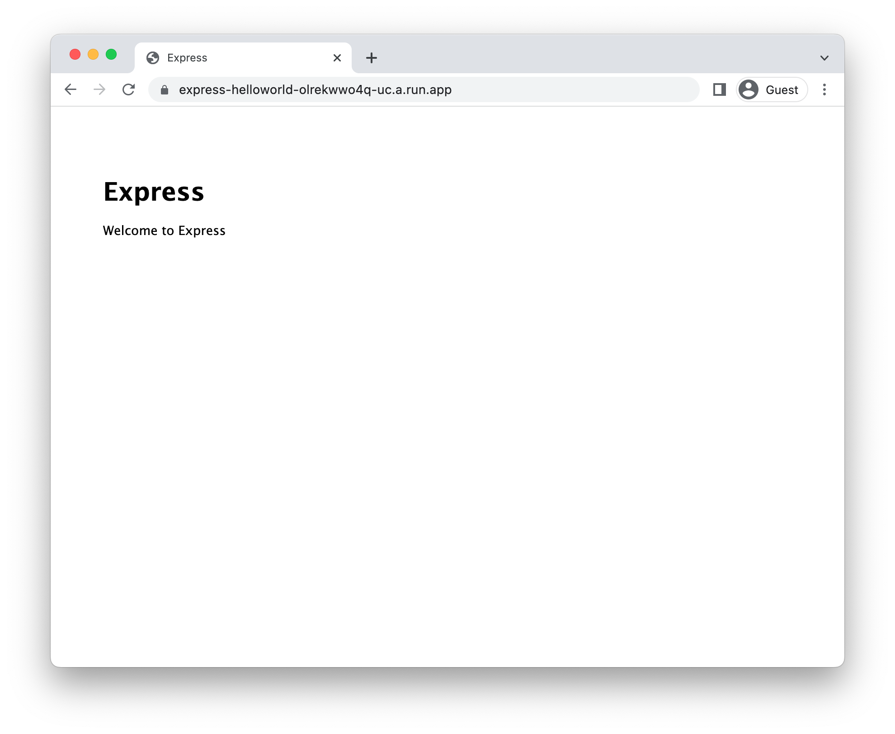

# Running Express on Cloud Run

<!--- Generated 2022-08-24 05:21:43.340567 -->

To deploy a [Express](https://expressjs.com/) application to Cloud Run, you will need an application
based on this framework. This demo gets you to use the Express template to generate one. 

This requires [node, npm](https://cloud.google.com/nodejs/docs/setup), and [gcloud](https://cloud.google.com/sdk/docs/install). 

### Create template application


* Generate a new template application: 

    ```bash
    npx express-generator helloworld
    cd helloworld
    npm install

    ```


* Navigate to the created project:

    ```bash
    cd helloworld/
    ```

* Run the application locally:

    ```bash
    npm start
    ```

    Enter `Ctrl+C` or `CMD+C` to stop the process.


## Configure for Cloud Run

Using [Cloud Buildpacks](https://github.com/GoogleCloudPlatform/buildpacks), 
the base language is automatically identified.


For Node applications, it will automatically run `npm start` as the entrypoint if no other command is defined. 


Because this is a default for Express, no additional configuration is required.


## Deploy to Cloud Run

* Build and deploy the service to Cloud Run: 


    ```bash
    gcloud run deploy express-helloworld \
        --source . \
        --allow-unauthenticated 
    ```

    Type "Y" for all suggested operations.


Your service will now be deployed at the URL in the deployment output.



## Learn more

Resources: 

- https://expressjs.com/en/starter/generator.html
