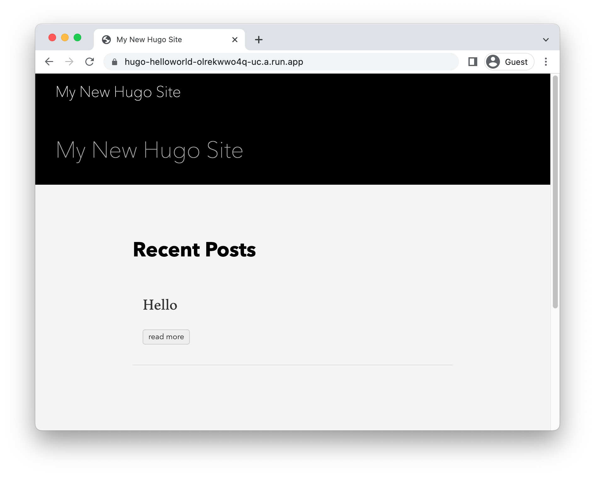

# Running Hugo on Cloud Run

<!--- Generated 2022-08-24 05:21:43.333262 -->

To deploy a [Hugo](https://gohugo.io) application to Cloud Run, you will need an application
based on this framework. This demo gets you to use the Hugo template to generate one. 

This requires [go](https://cloud.google.com/go/docs/setup), and [gcloud](https://cloud.google.com/sdk/docs/install). 

### Create template application


* Install the framework:

    ```bash
    https://gohugo.io/getting-started/installing
    ```

* Create a new template application:

    ```bash
    hugo new site helloworld
    hugo new posts/hello.md
    git submodule add https://github.com/theNewDynamic/gohugo-theme-ananke.git themes/ananke
    echo theme = \"ananke\" >> config.toml
    sed -i "" "s/true/false/g" content/posts/hello.md

    ```


* Navigate to the created project:

    ```bash
    cd helloworld/
    ```

* Run the application locally:

    ```bash
    hugo serve -D
    ```

    Enter `Ctrl+C` or `CMD+C` to stop the process.


## Configure for Cloud Run

Using [Cloud Buildpacks](https://github.com/GoogleCloudPlatform/buildpacks), 
the base language is automatically identified.


For go applications, you have specify what you want the web process to run using a `Procfile`. 

* Create a new file called `Procfile` with the following contents: 

    ```
    web: hugo serve -D
    ```


## Deploy to Cloud Run

* Build and deploy the service to Cloud Run: 


    ```bash
    gcloud run deploy hugo-helloworld \
        --source . \
        --allow-unauthenticated 
    ```

    Type "Y" for all suggested operations.


Your service will now be deployed at the URL in the deployment output.



## Learn more

Resources: 

- https://gohugo.io/getting-started/quick-start/
