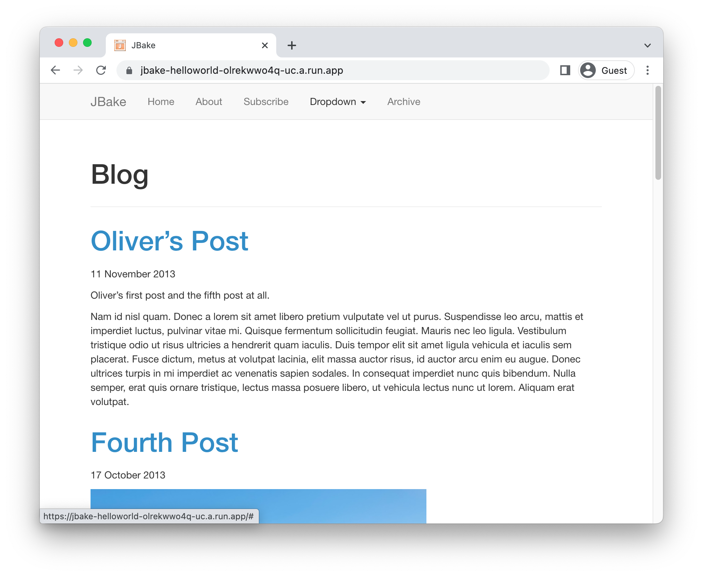

# Running JBake on Cloud Run

<!--- Generated 2022-08-24 06:42:26.201680 -->

To deploy a [JBake](https://jbake.org/) application to Cloud Run, you will need an application
based on this framework. This demo gets you to use the JBake template to generate one. 

This requires `java`
, and [gcloud](https://cloud.google.com/sdk/docs/install).


### Create template application


* Install the framework:

    ```bash
    curl -s "https://get.sdkman.io" | bash
    sdk install jbake

    ```

* Create a new template application:

    ```bash
    mkdir helloworld && cd helloworld
    jbake -i

    ```


* Navigate to the created project:

    ```bash
    cd helloworld/
    ```

* Run the application locally:

    ```bash
    jbake -b -s
    ```

    

    Enter `Ctrl+C` or `CMD+C` to stop the process.


## Configure for Cloud Run

Using [Cloud Buildpacks](https://github.com/GoogleCloudPlatform/buildpacks), 
the base language is automatically identified.


For java applications, you can specify what you want the web process to run using a `Procfile`. 

* Create a new file called `Procfile` with the following contents: 

    ```
    web: jbake -b -s
    ```


## Deploy to Cloud Run

* Build and deploy the service to Cloud Run: 


    ```bash
    gcloud run deploy jbake-helloworld \
        --source . \
        --allow-unauthenticated 
    ```

    Type "Y" for all suggested operations.


Your service will now be deployed at the URL in the deployment output.




## Learn more

Resources: 

- https://jbake.org/
