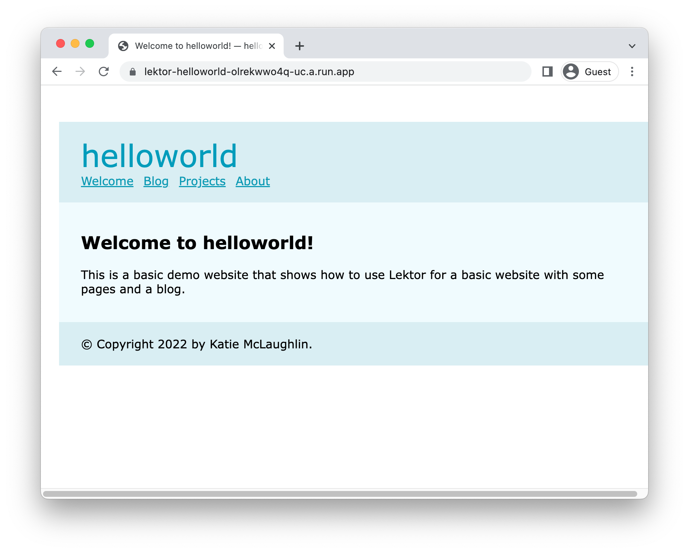

# Running Lektor on Cloud Run

<!--- Generated 2022-08-24 06:38:12.328294 -->

To deploy a [Lektor](https://www.getlektor.com) application to Cloud Run, you will need an application
based on this framework. This demo gets you to use the Lektor template to generate one. 

This requires [python3](https://cloud.google.com/python/docs/setup), and [gcloud](https://cloud.google.com/sdk/docs/install).


### Create template application


* Install the framework:

    ```bash
    pip install lektor
    ```

* Create a new template application:

    ```bash
    lektor quickstart
    # enter "helloworld" for project name, and accept all other defaults. 

    ```


* Navigate to the created project:

    ```bash
    cd helloworld/
    ```

* Run the application locally:

    ```bash
    lektor server
    ```

    Enter `Ctrl+C` or `CMD+C` to stop the process.


## Configure for Cloud Run

Using [Cloud Buildpacks](https://github.com/GoogleCloudPlatform/buildpacks), 
the base language is automatically identified.


For python applications, you can specify what you want the web process to run using a `Procfile`. 

* Create a new file called `Procfile` with the following contents: 

    ```
    web: lektor server
    ```


## Deploy to Cloud Run

* Build and deploy the service to Cloud Run: 


    ```bash
    gcloud run deploy lektor-helloworld \
        --source . \
        --allow-unauthenticated 
    ```

    Type "Y" for all suggested operations.


Your service will now be deployed at the URL in the deployment output.




## Learn more

Resources: 

- https://www.getlektor.com/docs/quickstart/
