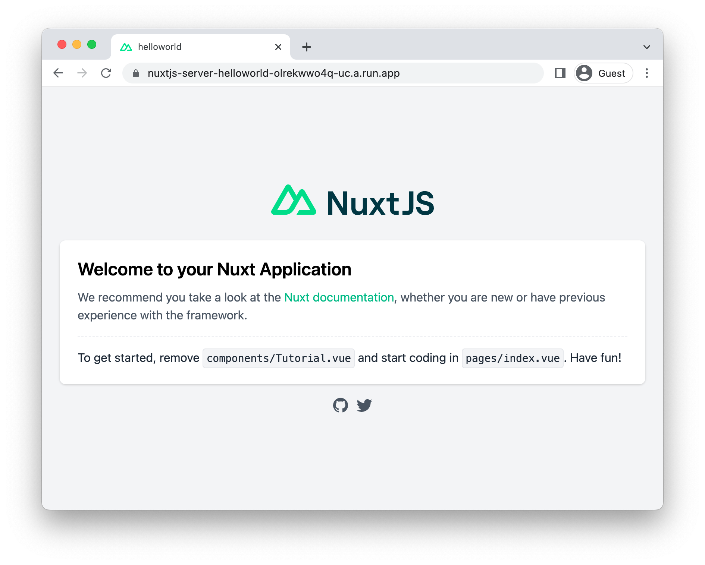

# Running Nuxtjs on Cloud Run

<!--- Generated 2022-08-24 06:52:10.087550 -->

To deploy a [Nuxtjs](https://nuxtjs.org/) application to Cloud Run, you will need an application
based on this framework. This demo gets you to use the Nuxtjs template to generate one. 

This requires [node, npm](https://cloud.google.com/nodejs/docs/setup), and [gcloud](https://cloud.google.com/sdk/docs/install).


### Create template application


* Generate a new template application: 

    ```bash
    npx create-nuxt-app helloworld
    # Choose defaults for all options, including "Deployment Target" (which will be "Server (Node.js hosting)")

    ```


* Navigate to the created project:

    ```bash
    cd helloworld/
    ```

* Run the application locally:

    ```bash
    npm run dev
    ```

    

    Enter `Ctrl+C` or `CMD+C` to stop the process.


## Configure for Cloud Run

Using [Cloud Buildpacks](https://github.com/GoogleCloudPlatform/buildpacks), 
the base language is automatically identified.


For Node applications, it will automatically run `npm start` as the entrypoint if no other command is defined. 


You can override this using a `Procfile`. 

* Create a new file called `Procfile` with the following contents: 

    ```
    web: npm run dev
    ```


* To ensure the Cloud Run deployment doesn't ignore Nuxtjs's hidden folder, make sure it's 
explicitly included: 

    ```bash
    echo "\!.next/" >> .gcloudignore
    ```


## Deploy to Cloud Run

* Build and deploy the service to Cloud Run: 


    ```bash
    gcloud run deploy nuxtjs-helloworld \
        --source . \
        --allow-unauthenticated \
        
    ```

    Type "Y" for all suggested operations.


Your service will now be deployed at the URL in the deployment output.




## Learn more

Resources: 

- https://nuxtjs.org/docs/get-started/installation
- https://nuxtjs.org/docs/get-started/commands
