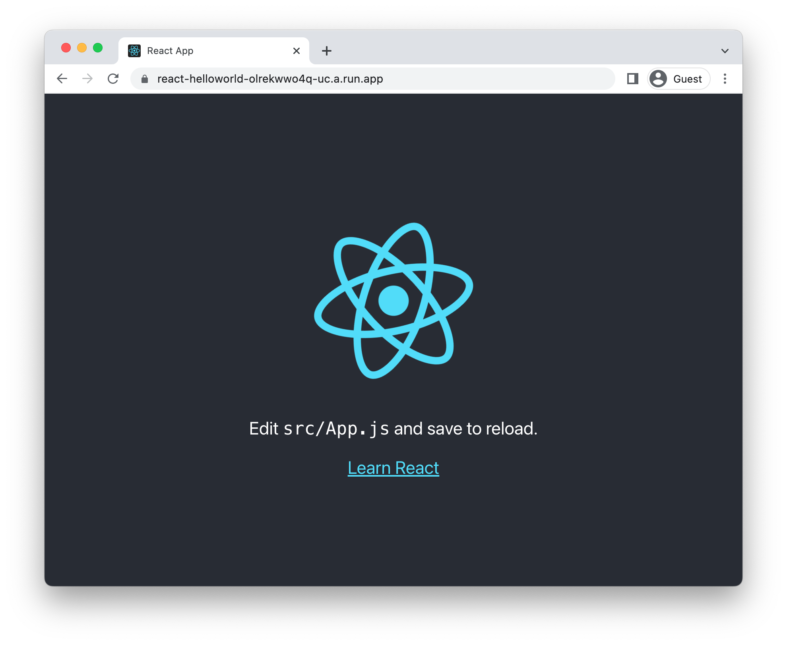

# Running React on Cloud Run

<!--- Generated 2022-08-24 06:43:53.364058 -->

To deploy a [React](https://reactjs.org/) application to Cloud Run, you will need an application
based on this framework. This demo gets you to use the React template to generate one. 

This requires [node, npm](https://cloud.google.com/nodejs/docs/setup), and [gcloud](https://cloud.google.com/sdk/docs/install).


### Create template application


* Generate a new template application: 

    ```bash
    npx create-react-app helloworld
    ```


* Navigate to the created project:

    ```bash
    cd helloworld/
    ```

* Run the application locally:

    ```bash
    npm start
    ```

    

    Enter `Ctrl+C` or `CMD+C` to stop the process.


## Configure for Cloud Run

Using [Cloud Buildpacks](https://github.com/GoogleCloudPlatform/buildpacks), 
the base language is automatically identified.


For Node applications, it will automatically run `npm start` as the entrypoint if no other command is defined. 


Because this is a default for React, no additional configuration is required.


## Deploy to Cloud Run

* Build and deploy the service to Cloud Run: 


    ```bash
    gcloud run deploy react-helloworld \
        --source . \
        --allow-unauthenticated 
    ```

    Type "Y" for all suggested operations.


Your service will now be deployed at the URL in the deployment output.




## Learn more

Resources: 

- https://create-react-app.dev/docs/getting-started
- https://create-react-app.dev/docs/deployment
