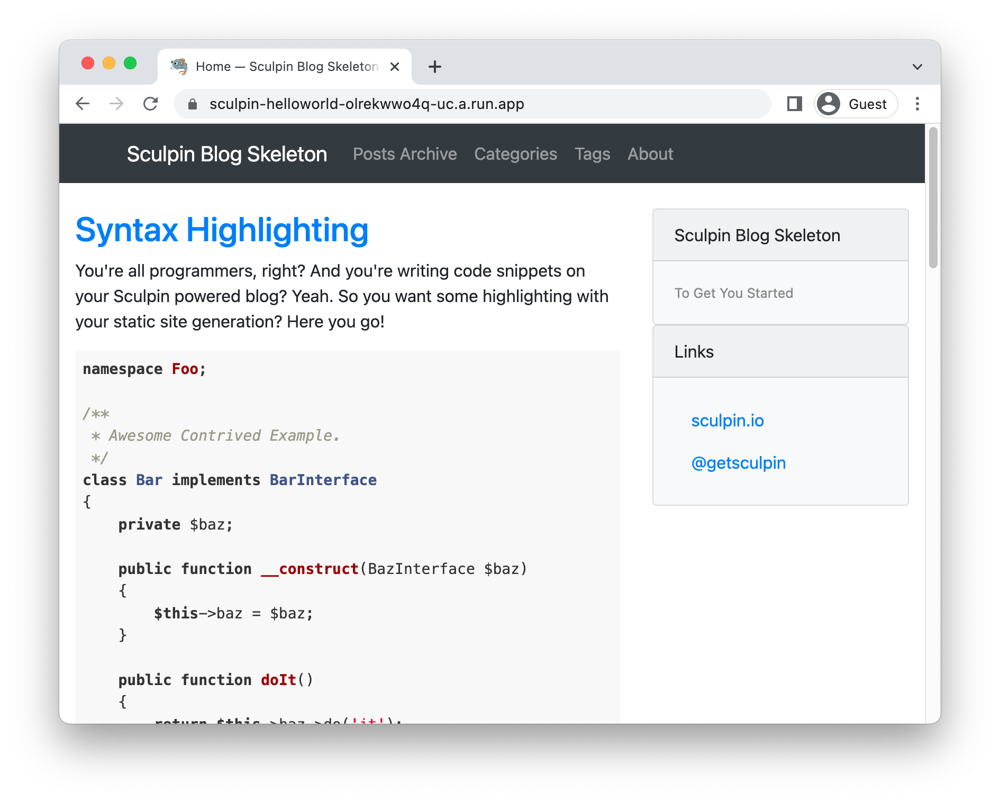

# Running Sculpin on Cloud Run

<!--- Generated 2022-08-24 05:34:09.494266 -->

To deploy a [Sculpin](https://sculpin.io) application to Cloud Run, you will need an application
based on this framework. This demo gets you to use the Sculpin template to generate one. 

This requires , and [gcloud](https://cloud.google.com/sdk/docs/install). 

### Create template application


* Generate a new template application: 

    ```bash
    brew install composer
    composer create-project sculpin/blog-skeleton helloworld

    ```


* Navigate to the created project:

    ```bash
    cd helloworld/
    ```

* Run the application locally:

    ```bash
    vendor/bin/sculpin generate --watch --server
    ```

    Enter `Ctrl+C` or `CMD+C` to stop the process.


## Configure for Cloud Run

Using [Cloud Buildpacks](https://github.com/GoogleCloudPlatform/buildpacks), 
the base language is automatically identified.


For php applications, you have specify what you want the web process to run using a `Procfile`. 

* Create a new file called `Procfile` with the following contents: 

    ```
    web: vendor/bin/sculpin generate --watch --server
    ```


## Deploy to Cloud Run

* Build and deploy the service to Cloud Run: 


    ```bash
    gcloud run deploy sculpin-helloworld \
        --source . \
        --allow-unauthenticated 
    ```

    Type "Y" for all suggested operations.


Your service will now be deployed at the URL in the deployment output.



## Learn more

Resources: 

- https://sculpin.io/getstarted/
