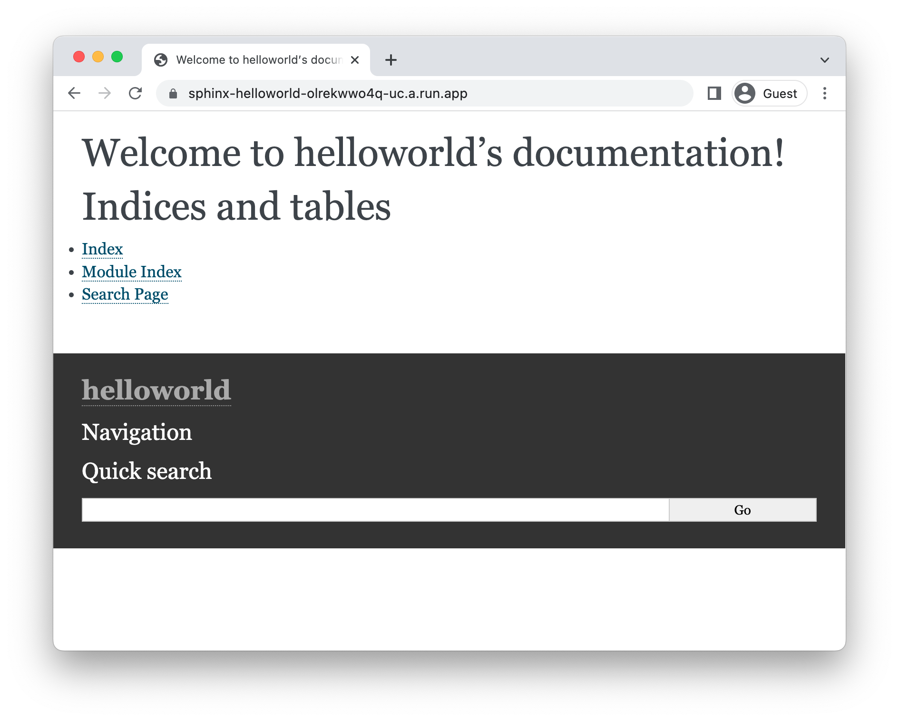

# Running sphinx on Cloud Run

<!--- Generated 2022-08-24 05:21:43.330497 -->

To deploy a [sphinx](https://www.sphinx-doc.org) application to Cloud Run, you will need an application
based on this framework. This demo gets you to use the sphinx template to generate one. 

This requires [python3](https://cloud.google.com/python/docs/setup), and [gcloud](https://cloud.google.com/sdk/docs/install). 

### Create template application


* Install the framework:

    ```bash
    pip install sphinx
    ```

* Create a new template application:

    ```bash
    sphinx-quickstart helloworld
    # enter prompted information, accepting defaults.

    ```


* Navigate to the created project:

    ```bash
    cd helloworld/
    ```

* Run the application locally:

    ```bash
    pip install sphinx-autobuild
    sphinx-autobuild . _build

    ```

    Enter `Ctrl+C` or `CMD+C` to stop the process.


## Configure for Cloud Run

Using [Cloud Buildpacks](https://github.com/GoogleCloudPlatform/buildpacks), 
the base language is automatically identified.


For python applications, you have specify what you want the web process to run using a `Procfile`. 

* Create a new file called `Procfile` with the following contents: 

    ```
    web: pip install sphinx-autobuild
sphinx-autobuild . _build

    ```


## Deploy to Cloud Run

* Build and deploy the service to Cloud Run: 


    ```bash
    gcloud run deploy sphinx-helloworld \
        --source . \
        --allow-unauthenticated 
    ```

    Type "Y" for all suggested operations.


Your service will now be deployed at the URL in the deployment output.



## Learn more

Resources: 

- https://www.sphinx-doc.org/en/master/tutorial/getting-started.html
- https://github.com/executablebooks/sphinx-autobuild
