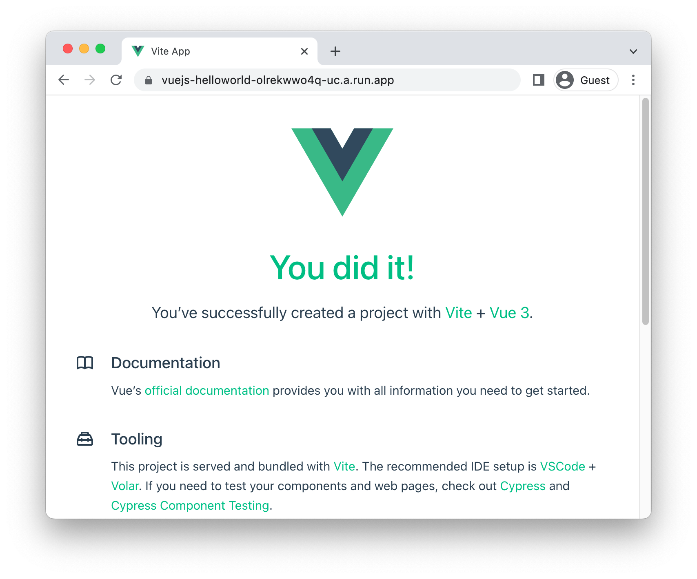

# Running VueJS on Cloud Run

<!--- Generated 2022-08-24 06:38:12.347985 -->

To deploy a [VueJS](https://vuejs.org/) application to Cloud Run, you will need an application
based on this framework. This demo gets you to use the VueJS template to generate one. 

This requires [node, npm](https://cloud.google.com/nodejs/docs/setup), and [gcloud](https://cloud.google.com/sdk/docs/install).


### Create template application


* Install the framework:

    ```bash
    npm init vue@latest
    ```

* Create a new template application:

    ```bash
    # Use "helloworld" for the project name
    # Press Enter for all other defaults. 
    npm install

    ```


* Navigate to the created project:

    ```bash
    cd helloworld/
    ```

* Run the application locally:

    ```bash
    npm run dev
    ```

    Enter `Ctrl+C` or `CMD+C` to stop the process.


## Configure for Cloud Run

Using [Cloud Buildpacks](https://github.com/GoogleCloudPlatform/buildpacks), 
the base language is automatically identified.


For Node applications, it will automatically run `npm start` as the entrypoint if no other command is defined. 


You can override this using a `Procfile`. 

* Create a new file called `Procfile` with the following contents: 

    ```
    web: npm run dev
    ```


## Deploy to Cloud Run

* Build and deploy the service to Cloud Run: 


    ```bash
    gcloud run deploy vuejs-helloworld \
        --source . \
        --allow-unauthenticated 
    ```

    Type "Y" for all suggested operations.


Your service will now be deployed at the URL in the deployment output.




## Learn more

Resources: 

- https://vuejs.org/guide/quick-start.html
- https://vuejs.org/guide/best-practices/production-deployment.html
