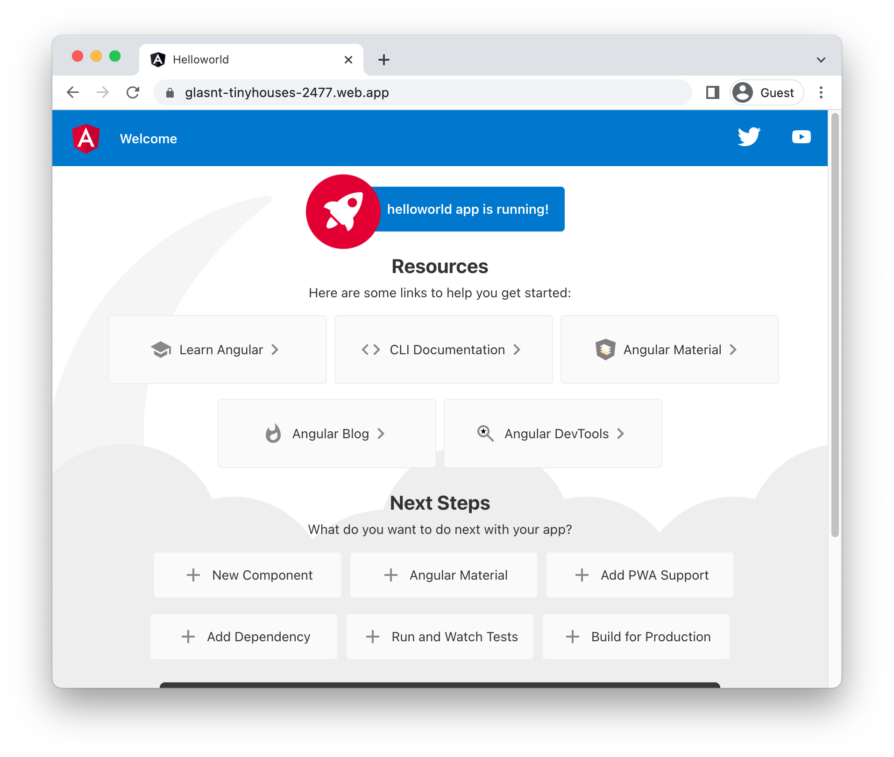

# Running Angular on Firebase

To deploy a [Angular](https://angular.io/) application to Firebase, you will need an application
based on this framework. This demo gets you to use the Angular template to generate one. 

This requires [node, npm](https://cloud.google.com/nodejs/docs/setup), and [firebase](https://cloud.google.com/firestore/docs/client/get-firebase).


To complete this demo, you will need a Firebase project. You can [create a new one](https://console.firebase.google.com/u/0/?pli=1), or connect an existing [Google Cloud project](https://cloud.google.com/firestore/docs/client/get-firebase).


### Create template application


* Install the framework:

    ```bash
    npm install -g @angular/cli
    ```

* Create a new template application:

    ```bash
    ng new helloworld
    ```


* Navigate to the created project:

    ```bash
    cd helloworld/
    ```

* Run the application locally:

    ```bash
    ng serve --open
    ```

    

    Enter `Ctrl+C` or `CMD+C` to stop the process.


## Deploy to Firebase

* Generate the application: 

    ```bash
    ng build
    ```

* Setup Firebase: 

    ```bash
    firebase init hosting
    ```

    * Select the Google Cloud project you configured earlier.
    * Choose "dist/helloworld" for the "public directory".
    * Chosoe the default for all other options.

* Deploy to Firebase: 

    ```bash
    firebase deploy --only hosting
    ```

Your service will now be deployed at the URL in the output under "Hosting URL".




## Learn more

Resources: 

- https://angular.io/tutorial/toh-pt0
- https://angular.io/start/start-deployment
