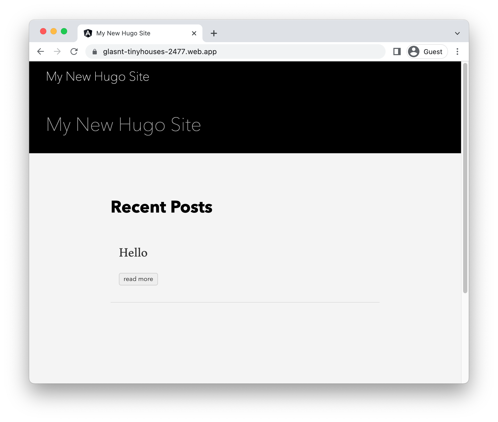

# Running Hugo on Firebase

To deploy a [Hugo](https://gohugo.io) application to Firebase, you will need an application
based on this framework. This demo gets you to use the Hugo template to generate one. 

This requires [go](https://cloud.google.com/go/docs/setup), and [firebase](https://cloud.google.com/firestore/docs/client/get-firebase).


To complete this demo, you will need a Firebase project. You can [create a new one](https://console.firebase.google.com/u/0/?pli=1), or connect an existing [Google Cloud project](https://cloud.google.com/firestore/docs/client/get-firebase).


### Create template application


* Install the framework:

    ```bash
    # https://gohugo.io/getting-started/installing

    ```
    
    

* Create a new template application:

    ```bash
    hugo new site helloworld
    cd helloworld/
    hugo new posts/hello.md
    git init .
    git submodule add https://github.com/theNewDynamic/gohugo-theme-ananke.git themes/ananke
    echo theme = \"ananke\" >> config.toml
    sed -i "" "s/true/false/g" content/posts/hello.md

    ```


* Run the application locally:

    ```bash
    hugo serve -D
    ```

    

    Enter `Ctrl+C` or `CMD+C` to stop the process.


## Deploy to Firebase

* Generate the application: 

    ```bash
    hugo -D
    ```

* Setup Firebase: 

    ```bash
    firebase init hosting
    ```

    * In "Project Setup", select the Google Cloud project you configured earlier.
    * For "What do you want to use as your public directory", enter `public`.
    * Choose the default for all other options.

* Deploy to Firebase: 

    ```bash
    firebase deploy --only hosting
    ```

Your service will now be deployed at the URL in the output under "Hosting URL".




## Learn more

Resources: 

- https://gohugo.io/getting-started/quick-start/
