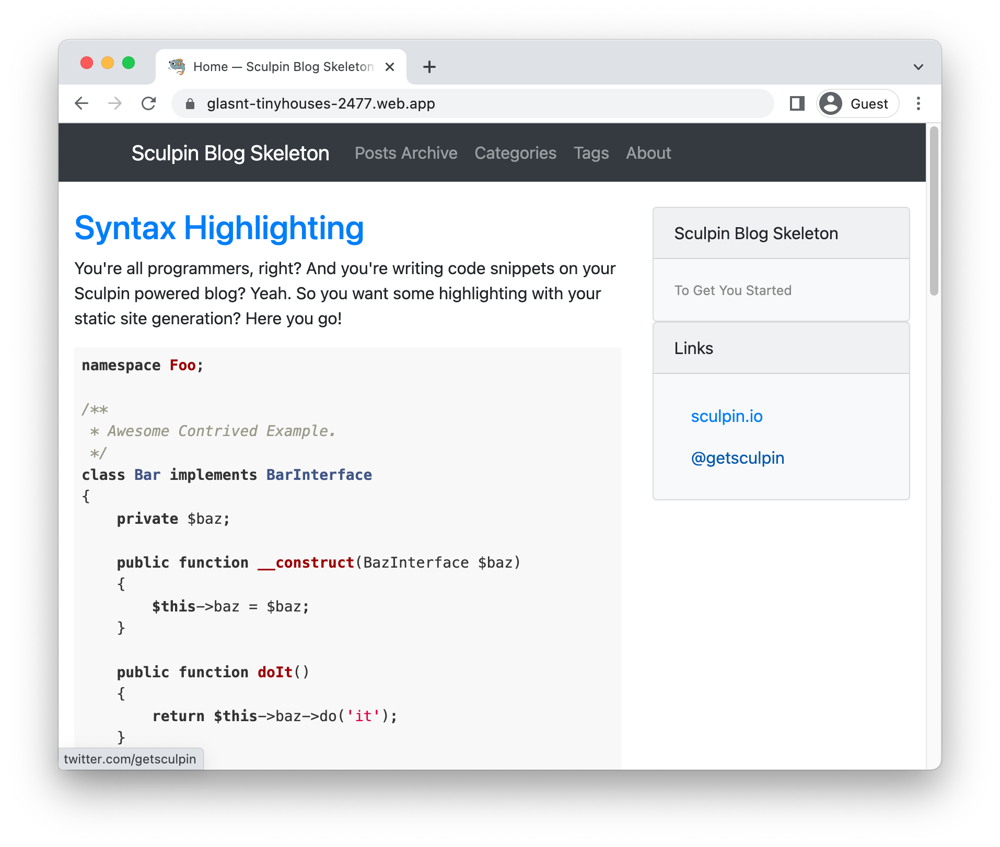

# Running Sculpin on Firebase

To deploy a [Sculpin](https://sculpin.io) application to Firebase, you will need an application
based on this framework. This demo gets you to use the Sculpin template to generate one. 

This requires [php](https://www.php.net/manual/en/install.php), and [firebase](https://cloud.google.com/firestore/docs/client/get-firebase).


To complete this demo, you will need a Firebase project. You can [create a new one](https://console.firebase.google.com/u/0/?pli=1), or connect an existing [Google Cloud project](https://cloud.google.com/firestore/docs/client/get-firebase).


### Create template application


* Generate a new template application: 

    ```bash
    brew install composer
    composer create-project sculpin/blog-skeleton helloworld

    ```


* Navigate to the created project:

    ```bash
    cd helloworld/
    ```

* Run the application locally:

    ```bash
    vendor/bin/sculpin generate --watch --server
    ```

    

    Enter `Ctrl+C` or `CMD+C` to stop the process.


## Deploy to Firebase

* Generate the application: 

    ```bash
    vendor/bin/sculpin generate
    ```

* Setup Firebase: 

    ```bash
    firebase init hosting
    ```

    * Select the Google Cloud project you configured earlier.
    * Choose "output_dev" for the "public directory".
    * Chosoe the default for all other options.

* Deploy to Firebase: 

    ```bash
    firebase deploy --only hosting
    ```

Your service will now be deployed at the URL in the output under "Hosting URL".




## Learn more

Resources: 

- https://sculpin.io/getstarted/
